# Timeline

[](https://github.com/vakahnke/Timeline/actions/workflows/ci.yml)
[](https://github.com/vakahnke/Timeline/releases)
[](LICENSE)
[](https://web-production-28ba24.up.railway.app)
[](#run-it-yourself-in-two-minutes)

**Plan it once. Do it. Keep the plan that worked.**

Timeline is a self-hosted project planner for the person who has to get something
big done, often for the first time: a product launch, a fundraise, an office move,
a hiring push, a first marathon. You work out the steps, put them on a timeline you
can actually grab, and run the project from it. When it is done, you save the plan
as a template, and the next launch, the next round, or the next person on your team
starts from a plan that already worked instead of a blank page.

The timeline is drawn on canvas, so dragging, zooming, dependency arrows and the
critical path stay smooth with hundreds of events on screen, including on a phone.
When leadership asks where the project stands, one click turns the same schedule into
a one-page status report you can print, save as a PDF, or download as a fully
editable PowerPoint slide.

**[Try the live demo](https://web-production-28ba24.up.railway.app)** (sign in as
`demo` / `demo12345`) · [Run it in two minutes](#run-it-yourself-in-two-minutes) ·
[Templates](#templates-the-plan-that-worked) ·
[The status report](#the-status-report-your-schedule-as-a-leadership-slide) ·
[User guide](docs/USER_GUIDE.md) · [Architecture](docs/ARCHITECTURE.md)

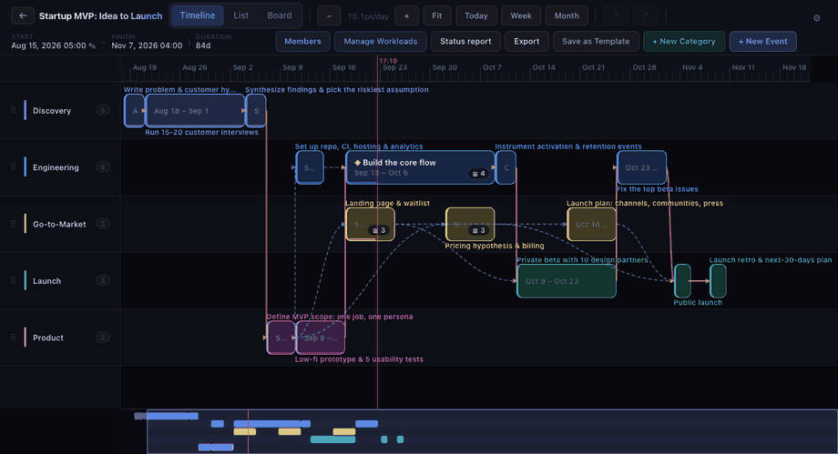

Free and open source under the [Apache 2.0 license](LICENSE): use it, modify it, and redistribute
it, including commercially. Every project is private to the people you invite, with four roles from
viewer to owner.

## Templates: the plan that worked

Most projects are not new. They are the second product launch, the fourth hire, the
annual conference. But the plan from last time lives in someone's head, a stale
document, or a spreadsheet nobody trusts, so every run starts over.

Timeline treats a finished project as the most valuable thing you own. Any project
can be saved as a template in one step. It keeps the tracks, the events, their
durations and dependencies, the notes, which events are key milestones, and the to-do
list inside each event. It forgets what belonged to that one run: the dates, the
progress, and who did what. Start a new project from it, pick the day it begins, and
every event lands in the right place with its dependencies intact, at zero percent,
ready to go. Then you adjust it for this run, do the work, and save it again if you
learned something.

Over time a team builds up a library of plans that are known to work. A new hire
running their first launch does not need to know how; they need the template from
the last one and a start date.

Timeline ships with built-in plans so you can see the idea before you have a
library of your own:

- **Business:** Startup MVP: Idea to Launch, Seed Fundraising Round, Customer
  Discovery Sprint, Go-to-Market Launch, Hire a Key Role, Quarterly OKR Cycle,
  Incorporate & Set Up the Company
- **Work:** Two-Week Sprint, Product Launch, Event Plan, Custom Shop Build
- **Hobby:** Homebrew a Batch of Ale, Backyard Raised-Bed Garden, First Marathon,
  Solid-Wood Dining Table Build, Record & Release a Song, Write Your First Novel,
  Frame-Off Classic Car Restore, Hand-Knit Sweater, Open Water Diver Certification,
  Build a Steel-String Acoustic

The hobby plans are not a joke. They are there because the tool is for anyone who
has to do a big thing well, and a marathon has dependencies too.

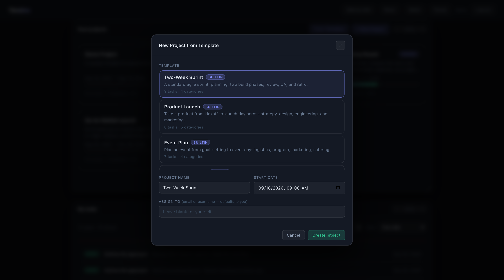

## The status report: your schedule as a leadership slide

Most project managers rebuild the same slide by hand every week or two: copy the
dates into PowerPoint, pick a color, and hope the numbers still match the plan.
Timeline writes that page from the schedule itself. Click **Status report** in a
project's toolbar and it opens already filled in.

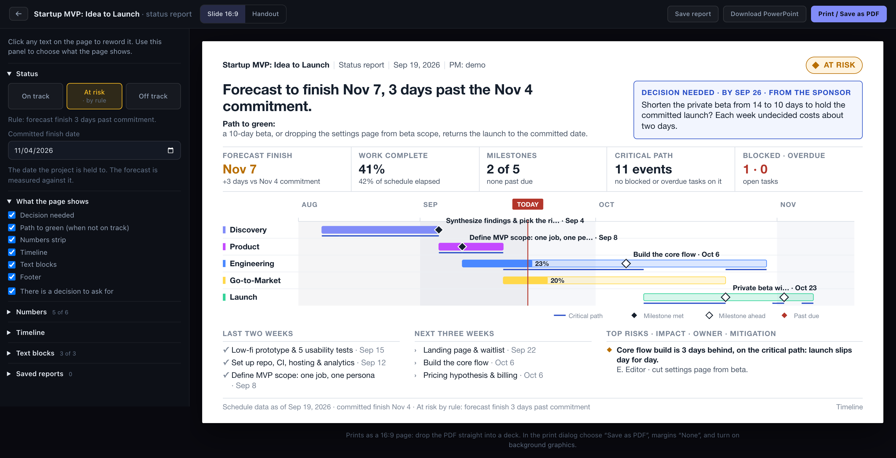

- **A status you can defend.** On track, At risk, or Off track is derived by rule
  from the forecast finish against your committed date, missed milestones, and
  blocked work on the critical path. The rule that fired is printed in the
  footer. You can overrule it, but only with a reason, and the reason prints too.
- **Written for the reader.** A one-sentence headline drafted from the numbers, a
  path to green, the one decision you need and who it is from, five numbers each
  shown against a reference, a simplified timeline with your key milestones, what
  finished, what is next, and the top risks.
- **Edited where you print.** Click any text on the page to reword it. Switch
  blocks on and off, add your own numbers and text blocks, hide tracks, and pick
  the milestones for this audience. If the page gets too full it tells you what
  to cut; it never shrinks the type.
- **A real PowerPoint, not a picture.** **Download PowerPoint** produces a `.pptx`
  made of native text boxes, a grouped timeline drawn from shapes, and a real
  table. Everything stays editable, and pasting the slide into your own deck picks
  up that deck's fonts.
- **Or a PDF.** Print a single vector page as a 16:9 slide, or as a portrait
  handout on Letter or A4 that adds a milestone table.
- **History.** Save a dated copy. The next report starts from its shape and shows
  whether the status moved since last time.
- **Plan changes, only when you want them shown.** Optionally freeze an approved
  plan as a baseline and, per report, show what changed against it, what moved
  since the last report, and a milestone trend chart. All of it is off by default.
- **Your own limits.** Each project sets how late counts as At risk or Off track.
- **Built on an API.** The page reads one versioned, documented endpoint, so
  scripts and other tools can consume the same facts.

<p align="center">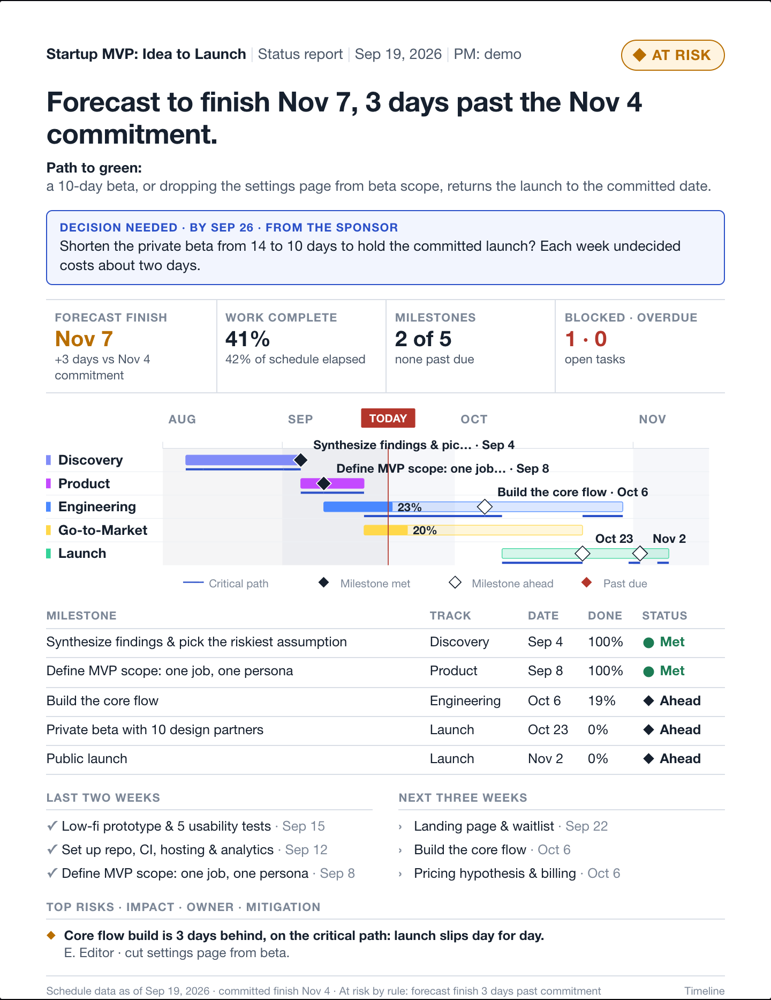</p>

### Optional: showing how the plan has changed

Plans should change. Keeping a plan current and pivoting in real time is healthy,
and most status reports have no reason to dwell on it. So by default the report
shows only where the project stands today.

Some audiences do need the history: a sponsor who approved specific dates, a
contract milestone, a review of why a launch moved. For those cases you can take a
**baseline**, a frozen copy of every event's dates at the moment the plan was
approved, and choose report by report whether to show changes against it.

1. Open **Status report** and, in the left panel, open **Baseline and limits**.
2. Name it, for example "Approved plan", and click **Set baseline**. Nothing on any
   report changes.
3. On a report that should show it, tick **Show changes against the baseline**.

That report then marks each track and milestone that moved ("Oct 6 (+3d)") and, on
the handout, lists baseline date, forecast date, and the difference. Two more
opt-in items sit beside it: a drafted **what moved since last report** line, and a
**milestone trend chart** on the handout. Re-baseline whenever new dates are
agreed; old baselines are kept. The same panel holds the project's **limits** for
the status rule: how late counts as Off track.

Try it on the [live demo](#live-demo): open **Startup MVP: Idea to Launch** and
click **Status report**. Details are in the [user guide](docs/USER_GUIDE.md) and
the [design doc](docs/design/status-one-pager.md).

## Live demo

**https://web-production-28ba24.up.railway.app**

Sign in as `demo` with password `demo12345` (or `editor` / `viewer` with the same
password to see the other roles), or register your own account. The demo is
public and writable, and it is wiped and reseeded every six hours, so do not
keep anything real in it. Tip: hold Ctrl (⌘ on a Mac) and drag an event to move
it; a plain drag pans.

## Run it yourself in two minutes

Requires [Docker](https://docs.docker.com/get-docker/). No other setup: no `.env`,
no database to install.

```bash
git clone https://github.com/vakahnke/Timeline.git
cd Timeline
SEED_DEMO=1 docker compose up --build
```

Open **http://localhost:5173** and sign in as `demo` with password `demo12345`.
The seed creates three users and four projects, including two startup plans that
are already in flight so the timeline, board, and task panels have content.

| Username | Password    | Role on the sample projects |
|----------|-------------|-----------------------------|
| `demo`   | `demo12345` | Owner                       |
| `editor` | `demo12345` | Editor                      |
| `viewer` | `demo12345` | Viewer                      |

Leave `SEED_DEMO` off for an empty instance. The first account you register will
need approval in the Django admin unless you set `REQUIRE_ACCOUNT_APPROVAL=0`
(see [`.env.example`](.env.example)).

## What you get

**The timeline.** Hold Ctrl (⌘ on a Mac) and drag an event to move it, drag its
edge to resize it, or drag it onto another track to recategorize. A plain drag
pans the canvas, so you never nudge an event by accident. Zoom smoothly from months down to minutes with
Ctrl/⌘ + scroll or a pinch. Pan by dragging empty space. Press `0` to fit the
whole project. A minimap at the bottom shows the whole plan and lets you jump
around long projects. Dependencies draw as arrows and the critical path is
highlighted automatically.

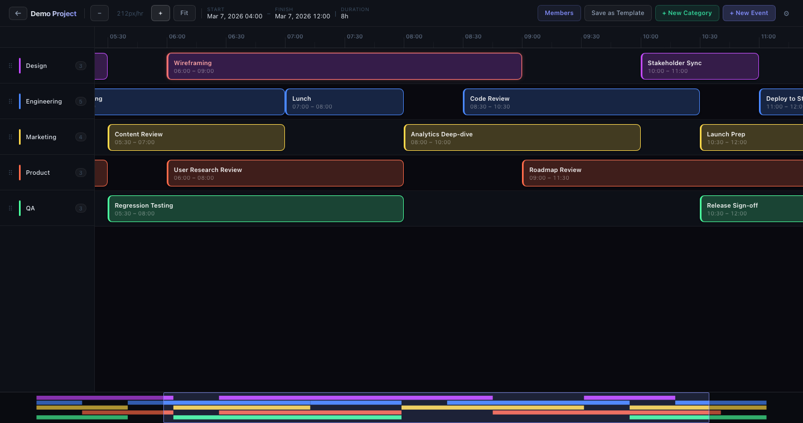

**Three views of one plan.** Timeline for planning, a board grouped by task
status for day-to-day work, and an agenda-style list.

**Works on a phone, timeline included.** Drag to pan, pinch to zoom, press and
hold an event to pick it up and move it, and drag the dots at its ends to resize.
A quick swipe never moves anything, which is the touch version of the Ctrl/⌘ rule. The status report is one tap away on the **Report** tab: the slide shown whole, and the same report below it at a size you can read and edit.

<p align="center">
  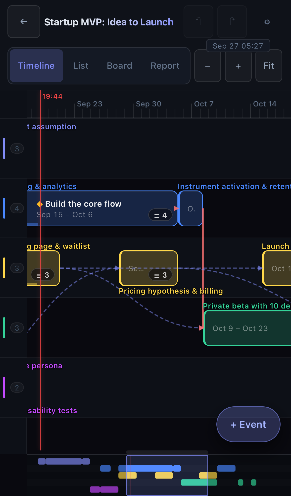
  &nbsp;
  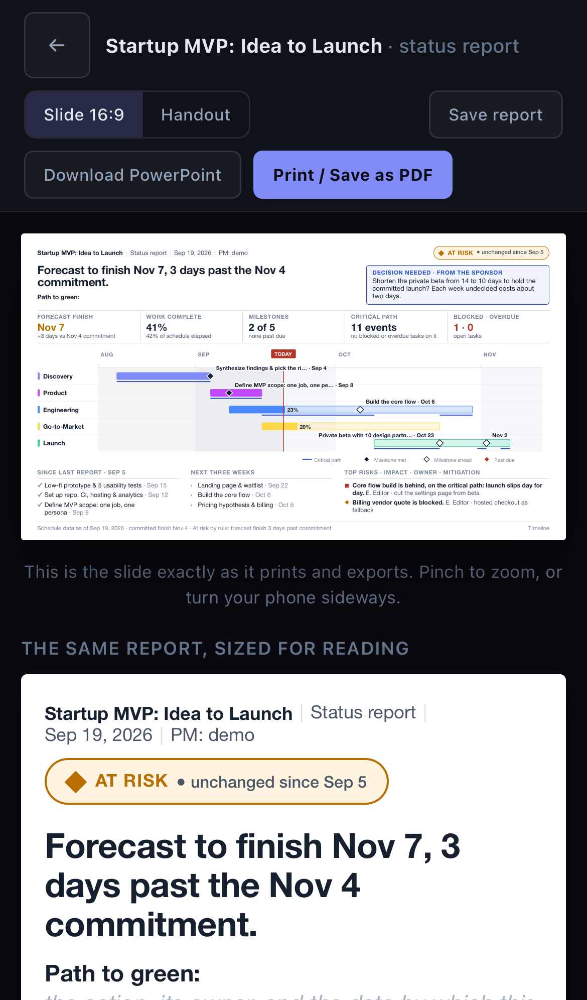
  &nbsp;
  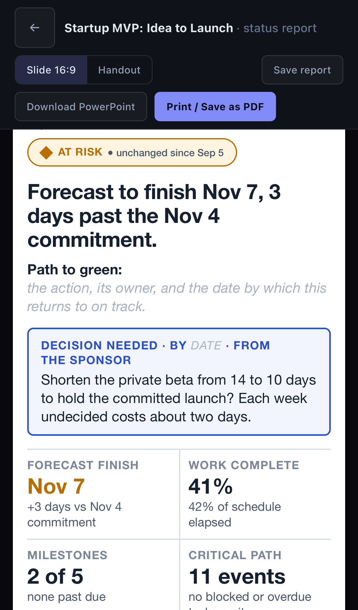
</p>

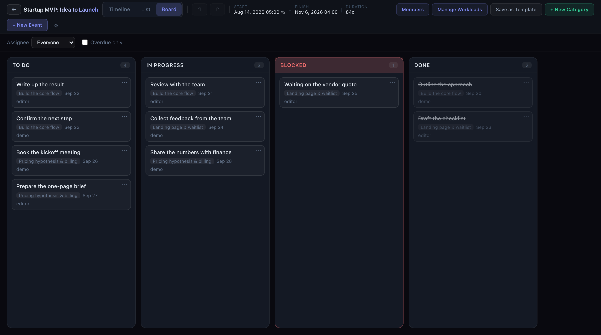

**Events with substance.** Each event has notes, a percent-complete slider,
predecessors and successors you pick from a list, sub-tasks with owners and due
dates, and a comment thread.

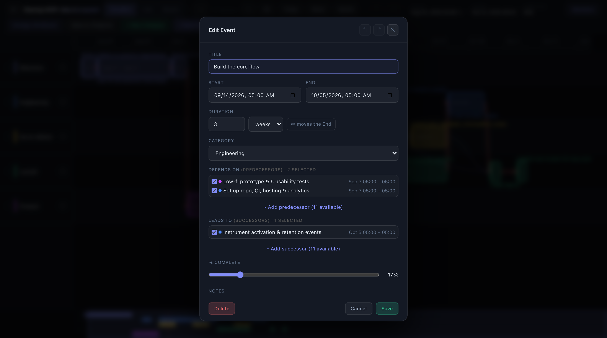

**Gets along with other tools.** Export a project to a calendar file (`.ics`) for
Outlook, Google Calendar and Apple Calendar, everything or key milestones only. Or
export Microsoft Project XML, the interchange format most scheduling tools open,
with dependencies intact and tasks set to manual scheduling so your dates arrive
unchanged. The XML is validated against Microsoft's published schema.

**Teams and roles.** Every project is private to its members. Roles are owner,
editor, commenter, and viewer. Reusable teams let you add a whole group to a
project at one role in a click, and team membership changes flow through to
projects live.

**A dashboard that knows what you owe.** Your projects with progress bars, and a
"My tasks" list across all of them sorted by due date.

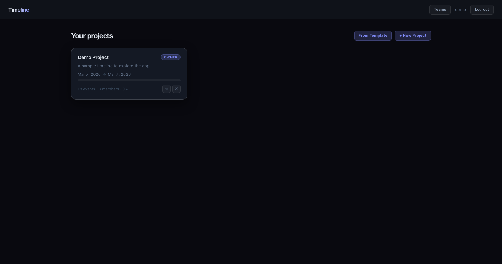

**An API you can build on.** Everything the UI does goes through a documented
REST API with JWT auth. Swagger UI lives at `/api/docs/` and ReDoc at
`/api/redoc/` on any running instance.

## Documentation

- [User Guide](docs/USER_GUIDE.md): accounts, projects, the timeline (gestures
  and shortcuts), templates, teams, roles, the admin console
- [Architecture](docs/ARCHITECTURE.md): tenancy model, data model, auth flow,
  frontend design, request flow
- [Deployment](docs/DEPLOYMENT.md): production stack, environment variables,
  nginx and gunicorn, CI
- [AWS Deployment](docs/AWS_DEPLOYMENT.md): a worked example on EC2 with
  Terraform, Cloudflare, and HTTPS
- [Railway demo](docs/DEPLOY_RAILWAY.md): the single-container image behind
  the public demo, with a scheduled reset
- [Design docs](docs/design/): how larger features are designed before they are
  built, plus the designs for the [board](docs/KANBAN.md) and
  [permissions](docs/PERMISSIONS.md)

## Tech stack

| Layer    | Stack                                                                                   |
|----------|-----------------------------------------------------------------------------------------|
| Backend  | Python 3.12, Django 6.1, Django REST Framework, SimpleJWT, drf-spectacular, PostgreSQL 15+ |
| Frontend | React 19, Vite 8, React Router 7, @dnd-kit for the board. Plain JSX and CSS, no UI kit  |
| Infra    | Docker Compose for dev and prod, nginx + gunicorn in prod, GitHub Actions CI            |

The timeline canvas, dependency arrows, lane backgrounds, and minimap are drawn on
HTML canvas rather than the DOM, which is what keeps panning and zooming smooth
with hundreds of events, including on Safari.

## Development

The dev stack runs Postgres, the Django API, and the Vite dev server with hot
reload in containers. Source directories are mounted, so edits show up
immediately.

```bash
docker compose up --build
```

| Surface               | URL                             |
|-----------------------|---------------------------------|
| App (hot reload)      | http://localhost:5173           |
| API                   | http://localhost:8000/api/      |
| API docs (Swagger)    | http://localhost:8000/api/docs/ |
| Django admin          | http://localhost:8000/admin/    |

Postgres is published on host port 5433 so it does not collide with a local
Postgres. Copy `.env.example` to `.env` if you want to change any setting; the
defaults work without it.

Useful commands:

```bash
docker compose exec backend python manage.py load_sample          # seed demo users and projects
docker compose exec backend python manage.py load_sample --clear  # reseed from scratch
docker compose exec backend python manage.py createsuperuser      # for /admin
docker compose exec backend python manage.py test                 # backend test suite
```

CI runs on every push and pull request: Django system checks, a missing-migration
check, migrations and tests against a Postgres service, and a production build of
the frontend. See [`.github/workflows/ci.yml`](.github/workflows/ci.yml).

## Production

The production stack is a single origin behind nginx: it serves the built SPA and
proxies `/api`, `/admin`, and static files to gunicorn, with Postgres alongside,
all in Docker.

```bash
cp .env.example .env    # set DJANGO_DEBUG=0, a real DJANGO_SECRET_KEY, your domain, RUN_COLLECTSTATIC=1
docker compose -f docker-compose.prod.yml up -d --build
```

[Deployment](docs/DEPLOYMENT.md) covers the environment variables, TLS options,
and backups. [AWS Deployment](docs/AWS_DEPLOYMENT.md) is a complete worked
example with Terraform.

## API overview

All endpoints take a JWT in the `Authorization` header. The live schema at
`/api/docs/` is the reference; this is the shape.

| Method                | Path                                                          | Notes                              |
|-----------------------|---------------------------------------------------------------|------------------------------------|
| POST                  | `/api/auth/register/`, `/api/auth/token/`, `/api/auth/token/refresh/`, `/api/auth/logout/` | register, sign in, refresh, revoke |
| GET                   | `/api/me/`                                                    | current user                       |
| GET/POST/PATCH/DELETE | `/api/projects/`, `/api/projects/<id>/`                       | your projects                      |
| GET/POST/PATCH/DELETE | `/api/projects/<id>/members/`                                 | members (owner only)               |
| GET/POST/PATCH/DELETE | `/api/projects/<id>/events/`, `/api/projects/<id>/categories/` | viewers read, editors write       |
| POST                  | `/api/projects/<id>/events/bulk/`                             | bulk-create events                 |
| GET/POST/DELETE       | `/api/templates/`, `/api/templates/instantiate/`              | built-in and saved templates       |
| GET/POST/PATCH/DELETE | `/api/teams/`, `/api/teams/<id>/members/`                     | reusable teams                     |
| POST                  | `/api/projects/<id>/add-team/`                                | add a team at a role (owner only)  |

## Project structure

```
Timeline/
├── backend/                 # Django + DRF
│   ├── timeline_project/     # settings, root urls, wsgi
│   ├── projects/             # tenancy: Project, Membership, Team, Template, auth, permissions
│   ├── events/               # timeline domain: Category, Event, Task, Comment, load_sample
│   └── Dockerfile · entrypoint.sh · requirements.txt
├── frontend/                # React + Vite SPA
│   └── src/
│       ├── pages/            # Login, Register, ProjectsDashboard, ProjectTimeline, Teams
│       ├── components/       # Timeline, EventBlock, Minimap, Board, Toolbar, modals and panels
│       ├── auth/ · routes/ · ui/
│       └── api.js            # JWT client with single-flight token refresh
├── nginx/                   # prod reverse proxy + SPA serving
├── terraform/               # optional AWS infrastructure
├── docker-compose.yml       # dev stack
├── docker-compose.prod.yml  # prod stack
└── docs/                    # user guide, architecture, deployment, design docs
```

`index.html` at the repo root is the original single-file prototype the app grew
out of. It is kept for reference and is not part of the build.

## Contributing

Contributions are welcome, from typo fixes to new views. The short version:

1. Fork the repo and create a branch from `main`.
2. Run the dev stack and make your change. Add or update tests in `backend/`
   when you touch the API or data model.
3. Make sure `python manage.py test` passes and the frontend builds
   (`npm run build` in `frontend/`). CI runs the same checks on your pull request.
4. Open a pull request that says what changed and why. Screenshots help for
   anything visual.

For a larger feature, open an issue or a design doc first. The
[design docs README](docs/design/README.md) describes the process: a short
document that captures the current state, prior art, and the proposed design,
so the discussion happens before the code.

Open issues with context and pointers into the code are in the
[issue tracker](https://github.com/vakahnke/Timeline/issues); the ones marked
[good first issue](https://github.com/vakahnke/Timeline/issues?q=is%3Aissue+is%3Aopen+label%3A%22good+first+issue%22)
are the easiest way in, and one of them needs no coding at all. Questions and ideas are welcome in
[Discussions](https://github.com/vakahnke/Timeline/discussions).

Some directions that would be good contributions, roughly in order of effort:

- A signed-in "change password" screen: [design](docs/design/password-reset.md) (reset by email is built)
- A template library: explore, vote on, comment on and share plans, with a track record of how
  each one actually ran: [design](docs/design/template-library.md)
- A subscribable calendar feed, so calendars stay current without exporting again:
  [design](docs/design/icalendar-export.md) (the one-off `.ics` export is built)
- Import from Microsoft Project XML:
  [design](docs/design/ms-project-xml.md) (export is built)
- Manual card ordering within board columns
- Guest access for people outside the team, read-only, without an account
- A schedule-health check over the dependency graph: missing links, dangling
  tasks, unusually high float

## Security

If you find a vulnerability, please report it privately rather than in a public
issue. Use GitHub's "Report a vulnerability" button on the Security tab of this
repository. [SECURITY.md](SECURITY.md) has the details.

## About

I manage projects for a living. Every project I ran taught me something about how to
run the next one, and none of my tools had a place to keep that. I wanted a planner
where the plan is the thing you build, and a finished plan is the thing you keep:
grab an event and move it, see what it pushes, hand leadership a slide without
rebuilding it by hand, and when it is done, save it for next time. I did not have the coding chops to build that alone. Timeline was built with
a great deal of help from an AI coding assistant (Claude), and every change is tested and checked
against the running app before it ships. Bug reports, ideas and pull requests are all welcome; the
[issues](https://github.com/vakahnke/Timeline/issues) marked *good first issue* are a fine place to start.

If Timeline is useful to you, a star helps other people find it.

## License

Apache License 2.0. See [LICENSE](LICENSE) and [NOTICE](NOTICE). Third-party
dependencies and their licenses are listed in
[THIRD_PARTY_LICENSES.md](THIRD_PARTY_LICENSES.md).
