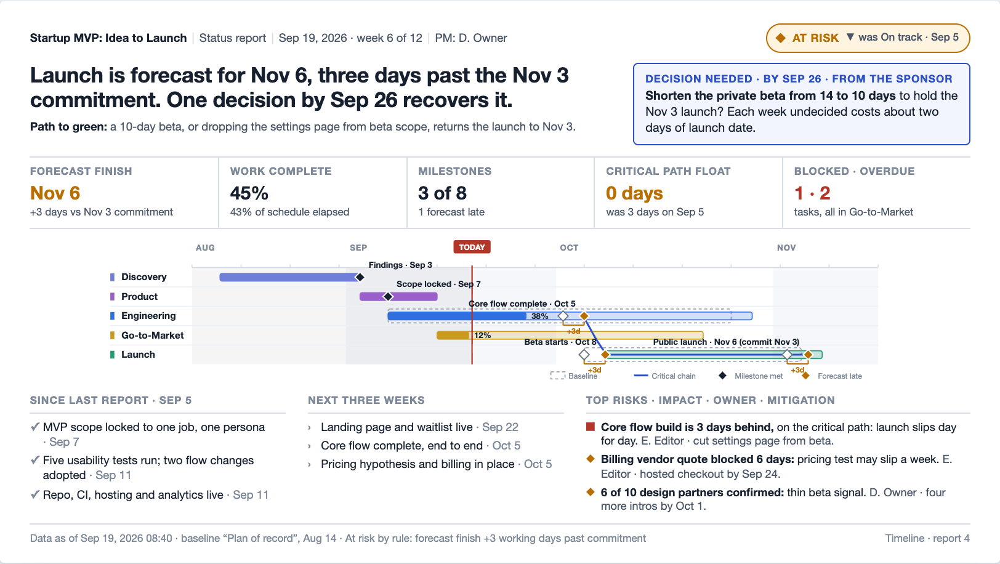
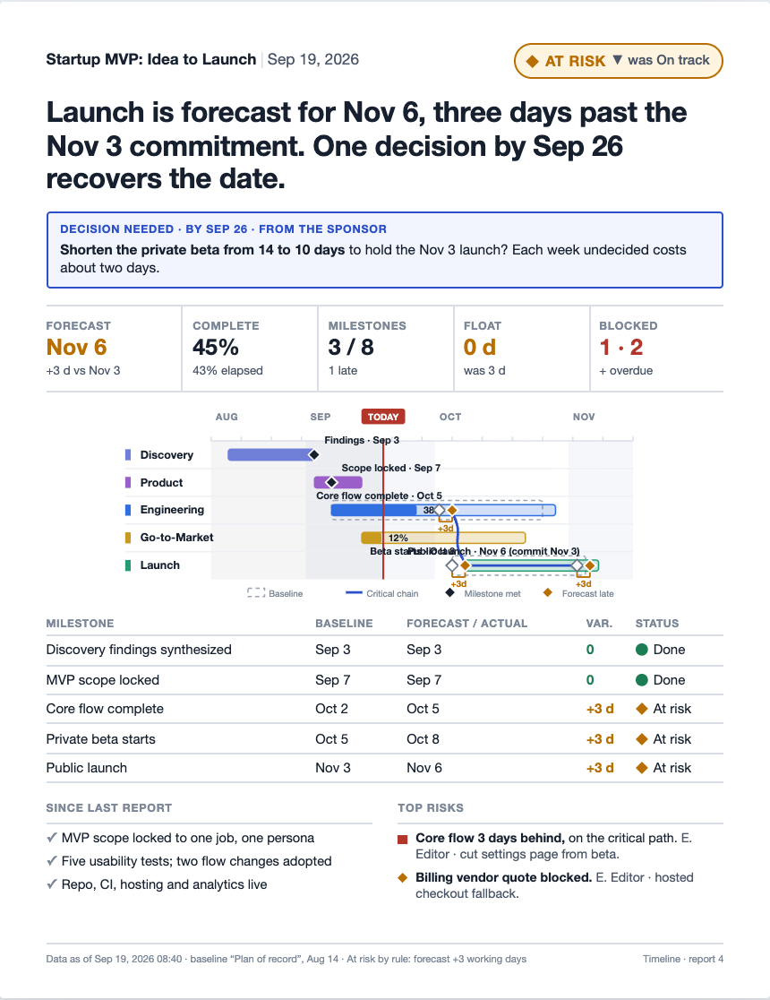

# Status One-Pager — Design Document

**Status:** Building — Phase 1 (the page, the print tool, print/PDF) and phase 2 (native PowerPoint) shipped 2026-09-19. Phase 3 (baselines, trends) not started.
**Last updated:** 2026-09-19
**Scope:** A per-project status report composed inside Timeline and exported as a native, editable PowerPoint slide and a print-ready PDF handout. Touches the data model (reports, baselines, milestones), the API, a new composer page, and two export renderers.

---

## 0. Problem / motivating requirements

Project managers regularly have to put **one slide** in front of leadership that says where a
project stands. Today that slide is rebuilt by hand every time: screenshot the timeline, retype
dates into PowerPoint, guess at a status color, and hope the numbers still match the plan by the
time the meeting starts. The plan already lives in Timeline. The slide should come out of it.

Requirements:

- **R1. One page.** A 16:9 slide for the deck and a Letter/A4 portrait handout for the table.
  Same report, two genuinely different layouts.
- **R2. Native, editable PowerPoint.** Real text boxes, real shapes for the timeline, a real table.
  The PM pastes the slide into someone else's deck and rewords it. A screenshot on a slide fails this.
- **R3. Print-quality PDF.** Vector, sharp at any size, legible in black and white.
- **R4. Mostly automatic.** Dates, progress, milestones, what finished, what is next, blocked and
  overdue work all come from the schedule. The PM writes only what needs judgment: the headline,
  the risks, the ask.
- **R5. Honest.** The status color is derived from the schedule by a published rule. A PM may
  overrule it, but the page says so. Forecast and commitment are shown side by side.
- **R6. Built around what leaders actually read** (section 2), not around what is easy to generate.
- **R7. History.** Each report is saved, so the next one can show a trend and "since last report".
- **R8. Runs in the small deployment.** No headless browser, no office suite on the server. It
  must also work in the single-container image (`deploy/railway.Dockerfile`).

Non-goals for now: budget and earned-value reporting, resource/staffing charts, scheduled or
emailed reports, a multi-project portfolio slide (phase 3, below).

## 1. Current state (grounding)

What the app already knows (from `backend/projects/models.py`, `backend/events/models.py`, the
serializers, and `frontend/src/components/Timeline.jsx`):

- **Project**: `name`, `description`, `owner`, members with roles, and aggregates computed in
  `ProjectViewSet.get_queryset` and exposed by `ProjectSerializer`: `start` (min event start),
  `end` (max event end), `progress` (mean `percent_complete`), `event_count`.
- **Event**: `title`, `start`, `end`, `category` (the track/phase), `percent_complete` (manual,
  0 to 100), `notes`, `depends_on` (finish-to-start predecessors).
- **Task** (inside an event): `status` in todo / in_progress / blocked / done, `assignee`, `owner`,
  `due_date`. **Comment**: per event.
- **Critical path** is computed **client-side only**, in `Timeline.jsx` (`criticalEventIds`,
  forward/backward pass, float). The backend does no scheduling.
- The on-screen timeline is drawn on **canvas** (ruler, lane backgrounds, arrows, minimap). Canvas
  prints as a bitmap, so it cannot be reused for a sharp printout.
- There is no print stylesheet and no export of any kind.

What is missing, and shapes the design (the first two are the same gaps recorded in
[probabilistic-schedule.md](probabilistic-schedule.md)):

1. **No committed date and no baseline.** "Planned end" is `max(event.end)`, which moves whenever
   anyone drags an event. There is nothing frozen to measure slip against.
2. **No history.** No status snapshots, no record of what a date used to be, so no trend and no
   "since last report".
3. **No milestone concept.** Every event is a bar. Nothing marks the five or six dates leadership
   tracks.
4. **No place for judgment.** Headline, risks, issues, decisions needed: none of it has a home.
5. **No server-side schedule math**, which a server-rendered export needs.

## 2. Prior art / research

Two research passes (2026-09-19): what makes a leadership status page work, and how to export it.
Sources are listed at the end. Vendor and practitioner sources dominate; thresholds below are
conventions, not standards.

**What leaders read, and in what order.** Status first, then *what do you need from me*, then
risks; roughly three to five minutes on the page. The slide title should state the conclusion, not
the topic: the consulting "action title" convention built on Minto's pyramid principle. Duarte's
advice to executives' presenters is the same: lead with the summary, treat the rest as appendix.
Asana recommends a two to three sentence summary plus a color; Atlassian caps updates at about
280 characters and, when a date moves, reports it against the original date with the reason.
Activity lists ("held four workshops") are ignored; accomplishments matter only as evidence for
the forecast.

**The formats, and how each fails.**

| Format | Works when | Fails when |
|---|---|---|
| Stoplight (red/amber/green) | Scanning many projects; thresholds agreed in advance | The color is chosen by the PM, shows no trend and no reason: "watermelon" reporting, green outside and red inside |
| Four-quadrant status slide | Familiar, easy to fill in | Four equal boxes mean no conclusion, and the ask is buried last |
| Plan on a page / roadmap | Showing the shape of the plan | Shows no status unless baseline and today are overlaid |
| Milestone table (baseline, forecast, variance) | The most honest compact format; prints well | More than about eight rows, or no baseline column |
| Milestone trend chart | Catches repeated small slips across reports | Needs stored history; unfamiliar to many audiences |
| Status-update feeds (Asana, Atlassian, Linear) | Frequent, low-ceremony updates | No schedule evidence on the page |

**Making status honest.** Compute the color from project data against thresholds agreed with the
sponsor; "amber if the forecast slips more than two weeks is a criterion, amber if the PM is
worried is not". Published conventions put green within about 5% schedule variance and red beyond
10 to 15% or on a missed milestone with no recovery path. Print the rule that fired. Allow an
override only if the page flags it. Always show committed and forecast dates together, with the
delta and a trend against the previous report. Anything not green carries a "path to green".

**Risks and asks.** Top three risks, one line each: impact, owner, mitigation, date. "Decisions
needed" is the second thing read, so it gets prime placement and its own visual treatment, naming
the decision, who decides, the date, and the cost of waiting. With no ask, say so explicitly.

**Visual rules.** The eye lands top-left. Status must be color plus shape plus word, because red
and green collapse for color-blind readers and on a grey-scale printer. Hard caps: three risks,
three asks, five to eight milestones, four to seven timeline rows. Nothing under about 10pt on a
slide read at a table; a printed handout can go to 9 to 10pt. Re-flow the portrait page; do not
shrink the slide onto it.

**Simplifying the Gantt.** Phases as bars, key milestones as diamonds with their dates written on
them, a today line, the past lightly shaded, only the critical chain to the finish rather than
every dependency arrow. OnePager Pro draws a thin baseline under the current bar, shows percent
complete as a fill, and keeps a snapshot per reporting period. think-cell uses a calendar-true
scale with a today line. A slipped milestone reads best as a hollow baseline diamond joined to a
solid forecast diamond with the slip written on the link.

**Export technology.**

| Option | License | Verdict |
|---|---|---|
| **python-pptx** 1.0.2 (server) | MIT | **Chosen for PPTX.** Native shapes, text, tables, theme colors; can open an existing `.pptx` and fill its layouts, so corporate templates are possible. Pure Python, about 15 MB of wheels, no system packages. Lightly maintained (last release 2024-08) but the format is stable |
| PptxGenJS 4.0.1 (browser) | MIT | Runner-up. About 123 KB gzipped and lazy-loadable, zero server load, but it cannot open an existing template, and it puts layout logic in JavaScript where a later scheduled export could not reuse it |
| **Browser print + print stylesheet, SVG timeline** | none | **Chosen for PDF in phase 1.** Vector output, selectable text, no new server software. Safari's `@page` handling is unreliable, so the page carries its own padding |
| WeasyPrint 70 (server) | BSD-3 | The escape hatch if emailed or scheduled PDFs are ever needed. Needs Pango (40 to 80 MB) and a server-rendered template, since it runs no JavaScript |
| Headless Chromium (Playwright) | Apache-2.0 / BSD | Rejected: 400 MB to 1 GB of image, 150 to 300 MB RAM per render, a new attack surface. Wrong for a single small container (R8) |
| html2canvas + jsPDF | MIT | Rejected: rasterizes, so the output is blurry and unsearchable |
| LibreOffice headless, Aspose, MS Graph, officegen, wkhtmltopdf | various | Rejected: image size and fidelity, proprietary license, no authoring API, abandoned, unmaintained and insecure, respectively |

Known PowerPoint pitfalls to design around: fonts are not reliably embedded, and Keynote and Google
Slides substitute Calibri, so leave 10 to 15% slack in every text box and use theme fonts; stored
autofit is recomputed only by PowerPoint, so use fixed sizes with wrapping and enforce length
limits before export; Google Slides rejects SVG pictures, so the timeline must be native shapes;
group the timeline shapes so they move as one but can be ungrouped; add shapes in reading order
and set alt text.

## 3. Proposed design

Mockups: the slide above, the handout below, and an annotated review board (private artifact,
shared on request). Sample data is the seeded "Startup MVP: Idea to Launch" project.

### 3.1 The page

Reading order is the layout.

1. **Identity bar**: project, report date and week, PM, and the **status chip**: shape + word +
   color, with a trend against the previous report ("was On track, Sep 5").
2. **Headline**: one sentence, at most 160 characters, stating the conclusion. Timeline drafts it
   from the numbers ("Launch is forecast for Nov 6, three days past the Nov 3 commitment.") and the
   PM edits it. Under it, any page that is not green carries a **path to green** line.
3. **Decision needed**: top right, the only boxed element on the page. What is being asked, of
   whom, by when, and what waiting costs. With nothing to ask it prints "No decisions needed".
4. **Five numbers**, each against a reference: forecast finish vs commitment, work complete vs
   time elapsed, milestones met, critical-path float vs last report, blocked and overdue tasks.
5. **The timeline, simplified by rule**: one bar per track with a progress fill, key milestones as
   diamonds labelled with their dates, a hollow baseline ghost where the plan slipped with the slip
   written on the link, the past shaded, a today line, and only the critical chain to the finish.
   At most seven rows; more tracks than that roll up into "Other".
6. **Since last report / next three weeks**: three items each, pre-filled from events completed
   since the previous report and events due soon, phrased as outcomes and editable.
7. **Top risks**: at most three, one line each in a fixed order: what, impact, owner, mitigation.
   Severity is a shape as well as a color.
8. **Footer**: when the data was read, which baseline, the rule that produced the status, and any
   PM override. Nothing on the slide is smaller than 10pt.

The **handout** re-flows rather than shrinks: the ask sits directly under the headline, and the
extra height holds the **milestone table** (baseline, forecast or actual, variance, status), which
is the audit trail a slide has no room for.

Status is always **circle / diamond / square** plus the words On track / At risk / Off track, so it
survives a grey-scale printer. The baseline ghost is an outline, not a lighter tint.

### 3.2 Deriving status

First match wins. Thresholds are per-project settings with these defaults, because the honest
stoplight is one whose limits were agreed before anything slipped.

| Status | Default rule |
|---|---|
| **Off track** | Forecast finish is more than 10 working days, or more than 10% of the project's length, past the commitment; or a key milestone is already missed with no recovery date |
| **At risk** | Forecast finish is late by any amount up to that limit; or critical-path float is gone and work complete is 10 points or more behind time elapsed; or a task on the critical path is blocked or overdue |
| **On track** | None of the above |

These defaults are deliberately stricter about the committed date than the common 5% / 15%
convention: a leader holds the PM to the date, not to a percentage. The rule that fired is printed
in the footer. The PM may overrule the result with a one-line reason, which is printed ("status
set by PM: …"); the rule's own answer is kept in the saved report.

Until a baseline exists (phase 3), "commitment" falls back to the project's planned end at the
time of the previous report, and the page says "no baseline set".

This shares its inputs with the health engine in
[probabilistic-schedule.md](probabilistic-schedule.md). Build the schedule math once (3.4) and let
both use it.

### 3.3 Data model

- **`StatusReport`** (new): `project`, `as_of`, `author`, `layout` (slide | handout default),
  `status` and `status_source` (rule | override) with `override_reason`, `rule_fired`, `headline`,
  `path_to_green`, `accomplishments`, `next_steps`, `risks`, `decision` (JSON lists with the fixed
  shapes above), `milestone_ids`, and **`snapshot`**: a frozen JSON copy of every computed number
  and the simplified timeline at the moment of saving. The snapshot is what makes a report
  reproducible, and what trend and "since last report" are computed from.
- **`Event.is_milestone`** (new boolean): marks a key milestone. Also drawn as a diamond on the
  main timeline, which is useful on its own.
- **`Baseline`** (new, phase 3): `project`, `name`, `created_at`, `committed_end`, and a JSON map of
  event id to start and end at the time it was frozen. One active baseline per project.
- **Project thresholds** (phase 3): the status-rule limits, stored on the project.

Risks stay as JSON inside the report for now. A first-class risk register is a separate feature
and should not be smuggled in here.

### 3.4 API

- `GET  /api/projects/<id>/status-report/draft/`: the computed payload for a new report: numbers,
  suggested status with the rule that fired, drafted headline, suggested lists, simplified
  timeline with positions normalized to 0..1. All date math and truncation happen here, once.
- `GET/POST /api/projects/<id>/status-reports/`, `GET/PATCH/DELETE …/<rid>/`: saved reports.
- `POST /api/projects/<id>/status-reports/export-pptx/`: the PowerPoint file, built from the page
  exactly as posted (see the phase 2 as-built notes in section 5).
- **Server-side critical path.** A small Python port of the forward/backward pass now in
  `Timeline.jsx`, in a new `backend/events/schedule.py`, with tests that pin it to the same
  answers as the client on the template projects. The client keeps its own copy for interaction
  speed; the report and the export use the server's.

### 3.5 Rendering: one payload, three thin renderers

- **Preview and composer** (React): an HTML page with an inline **SVG** timeline, laid out from a
  small shared layout spec (regions as fractions of a 13.333 × 7.5 in slide).
- **PDF / print**: the same component on a print route with a print stylesheet (`@page`, physical
  units, `print-color-adjust: exact`, its own padding so Safari's margins cannot clip it), and
  `window.print()`. No new server software.
- **PowerPoint**: `python-pptx` on the server, reading the same payload and the same layout spec:
  text boxes for text, rectangles and diamonds for the timeline (grouped, with alt text), a real
  table on the handout, theme colors and theme fonts so the host deck's look applies on paste,
  fixed font sizes with wrapping and 10 to 15% slack, no autofit. A golden-file test on shape
  geometry keeps the preview and the file from drifting apart.

### 3.6 The composer

A **Status report** button in the project toolbar opens a two-pane page: a form on the left, the
real page on the right at true proportions. Fields Timeline filled in are marked and can be
overwritten. Hard limits (three accomplishments, three next steps, three risks, one ask, headline
length) are enforced in the form; when something does not fit, the composer says what to cut
rather than shrinking the type. Actions: Save report, Print / PDF, Download PowerPoint, and a
layout switch between slide and handout. Saved reports are listed per project with their date and
status, which is also the trend history.

### 3.7 Permissions

Owners and editors create, edit and delete reports. Commenters and viewers can open and export
saved reports. No new roles; it follows [PERMISSIONS.md](../PERMISSIONS.md).

## 4. Alternatives considered

- **Screenshot the timeline onto a slide.** Fast, and exactly what PMs do by hand today. Not
  editable, blurry when scaled, and it carries the whole Gantt instead of a simplified one. Fails R2.
- **Generate the PPTX in the browser (PptxGenJS).** Attractive: no server work. Rejected as the
  primary path because it cannot fill a corporate template and would duplicate layout logic that a
  future scheduled export needs on the server. It stays the fallback if python-pptx proves limiting.
- **Server-side PDF from the start (WeasyPrint or headless Chromium).** Deterministic files, but
  new system libraries or a browser in the image, against R8. Browser print is good enough to
  start, and WeasyPrint remains available later.
- **A four-quadrant status slide.** The most familiar format. Rejected as the default because equal
  boxes give no conclusion and bury the ask; the blocks here can still be rearranged into one if a
  particular audience insists (open question 1).
- **Let the PM pick the color.** Simplest, and the root of watermelon reporting. The rule-plus-
  visible-override model costs little more and is the difference between a status and an opinion.
- **A full risk register and budget tracking.** Real needs, but each is its own feature. Keeping
  them out is what keeps this buildable.

## 5. Phasing

- **Phase 1 — the page. SHIPPED.** As built, and where it departs from the plan above:
  - **Customization happens in the print tool, at print time**, not in a settings area. Click any
    text on the page to reword it; the side panel switches blocks on and off, reorders them, adds
    custom numbers and free-text blocks, hides tracks, and picks the milestones for *this* report.
    A saved report's shape is the starting point for the project's next one.
  - **The page is a document, not columns.** `StatusReport.content` is a JSON document owned by
    the frontend (`frontend/src/components/report/reportModel.js`), so a project's page can change
    without a migration. Block kinds live in one registry (`BLOCK_KINDS` + `BLOCK_RENDERERS`).
  - **One versioned facts endpoint** (`GET …/status-reports/draft/`, documented in the OpenAPI
    schema) is the only thing the page reads. It never scrapes the app's screens, so UI redesigns
    cannot break it, and exports or scripts can consume the same payload.
  - **`Project.committed_end` arrived early** (it was planned with baselines): without a committed
    date the page's most important number cannot be computed.
  - **Variance is shown in calendar days everywhere on the page**; working days are used only for
    the off-track threshold.
  - **An overfull page warns instead of shrinking type**, and empty optional fields leave no trace
    on paper.
  - Verified by 20 backend tests and a 28-check browser test that generates real PDFs: one
    13.333 × 7.5 in page for the slide, one Letter or A4 page for the handout.

  Original scope: `StatusReport` model and API, server-side critical path, the draft
  payload, the composer with live preview, `Event.is_milestone`, saved reports, print / PDF through
  the print stylesheet. Without a baseline the page shows forecast dates and progress but no
  variance, and says so. Useful on its own.
- **Phase 2 — the deck. SHIPPED.** As built (`backend/events/pptx_export.py`):
  - **Download PowerPoint** sits next to Print in the print tool. The file is built from the page
    *as it stands in the browser*, unsaved edits included: the client posts the same document,
    status fields and facts snapshot it would save, and the server returns the file and stores
    nothing. So the endpoint is `POST …/status-reports/export-pptx/`, not a GET on a saved report,
    and it is open to every project member, the same people who can print.
  - **Everything is native and editable**: text boxes, a grouped "Timeline" of rectangles and
    diamonds with alt text, a real five-column table on the handout, status and severity as text
    glyphs. No pictures. Theme fonts, fixed sizes, no autofit. Provenance (as-of date, rule fired)
    travels in the speaker notes.
  - **The slide is 13.333 × 7.5 in; the handout is a Letter or A4 portrait page.** Heights are
    derived from the wording, so a long headline takes space from the timeline, not from the footer.
  - **Milestone labels use the same collision search as the page** and also avoid percent figures
    and other diamonds; a label that cannot fit shortens to its date.
  - Verified by 13 backend tests (geometry, content, permissions, nothing saved), a browser test
    that clicks the button and inspects the downloaded file, and an independent renderer used to
    look at the result. **Not yet opened in PowerPoint, Keynote or Google Slides by a person**:
    QuickLook and Keynote scripting both hung on the build machine.
- **Phase 3 — the truth.** Baselines and a committed date, slip as ghost bars and variance, the
  milestone table's baseline column, per-project thresholds, trend arrows and automatic "what
  moved since last report", a milestone trend chart once three reports exist.
- **Later / maybe:** a portfolio slide (all of a PM's projects, one row each), filling a
  user-supplied corporate template, scheduled or emailed PDFs via WeasyPrint, budget and staffing
  blocks.

## 6. Cost & risk

- **Effort:** Phase 1 L (new model, API, server schedule math, composer, SVG timeline, print CSS).
  Phase 2 M. Phase 3 M to L (migration, baseline UI, variance everywhere).
- **Risk — preview and PowerPoint drift apart.** Two renderers, one layout. Mitigation: the shared
  layout spec and a golden-file test on shape geometry.
- **Risk — text reflows differently** in PowerPoint, Keynote and Google Slides. Mitigation: theme
  fonts, fixed sizes, slack in every box, enforced length limits, and a three-application manual
  check each release.
- **Risk — python-pptx is lightly maintained.** Mitigation: pin the version, isolate the small XML
  helpers it needs (alt text, cell borders), and note that it is MIT and small enough to vendor.
- **Risk — browser print varies**, Safari margins especially, and the user must choose "Save as
  PDF". Mitigation: self-contained page padding; WeasyPrint as the escape hatch.
- **Risk — server and client critical paths disagree.** Mitigation: shared test fixtures that both
  implementations must satisfy.
- **Risk — scope.** This feature attracts requests (budget, staffing, risk register, templates).
  Held off by the non-goals in section 0 and by making blocks switchable rather than adding more.
- **Dependencies added:** `python-pptx` (MIT) and its wheels (`lxml` BSD, `Pillow` MIT-CMU,
  `XlsxWriter` BSD-2). All compatible with this project's Apache-2.0 license; they go into
  `THIRD_PARTY_LICENSES.md` when phase 2 lands.

## 7. Open questions

1. **Blocks.** Is this the right set for the audiences this serves? Some leadership teams expect
   budget, staffing, or a four-box layout. An existing slide that already works is the best input.
2. **Milestones.** A "key milestone" checkbox on the event (proposed), or chosen per report?
3. **Baseline timing.** Ship the page first and baselines right after (proposed), or hold the first
   release until slip against a frozen plan is on the page?
4. **Branding.** Plain, neutral slide first (proposed), or must it drop into a corporate template
   from day one?
5. **Cadence.** Is the report weekly, monthly, or per meeting? It sets the default "since last
   report" and "next" windows.

## Sources

Leadership reading and slide conventions: Duarte, "How to Present to Senior Executives", HBR
(hbr.org/2012/10/how-to-present-to-senior-execu); deckary.com/blog/consulting-slide-standards;
winningpresentations.com/pyramid-principle-presentations; pmostart.com/blog/executive-project-reporting;
asana.com/resources/how-project-status-reports; atlassian.com/team-playbook/plays/weekly-project-updates.
Honest status: cultivatedmanagement.com/watermelon-reporting; onplana.com/blog/rag-status-light-conventions;
portfoliohub.io/blog/rag-status; instituteprojectmanagement.com/blog/rag-status-in-project-management.
Visual design: perceptualedge.com (Few, "Formatting and Layout Matter"); brightcarbon.com/blog/presentation-font-size;
designsystemproblems.com/accessibility-compliance/accessible-status-indicators. Timeline simplification:
onepager.com/products/features/opp_baselines.html; think-cell.com/en/resources/manual/gantt;
officetimeline.com/timeline/templates/executive-report-timeline; rolandwanner.com/how-to-use-the-milestone-trend-analysis.
Export: pypi.org/project/python-pptx; github.com/gitbrent/PptxGenJS (issues 27, 712 on templates);
bundlephobia.com/package/pptxgenjs; pypi.org/project/weasyprint; playwright.dev/docs/docker;
wkhtmltopdf.org/status.html; github.com/mdn/browser-compat-data/issues/23178 (Safari `@page`).
